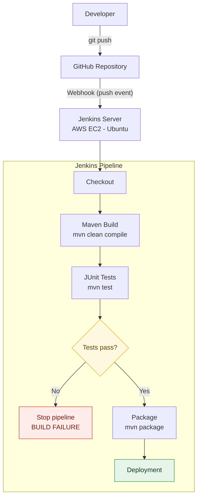

# Jenkins CI/CD Pipeline on AWS


An automated **Continuous Integration and Continuous Deployment (CI/CD)** pipeline built with **Jenkins, GitHub, Maven and JUnit**, hosted on an **AWS EC2 Ubuntu** server.

Every `git push` to GitHub automatically triggers Jenkins, which checks out the latest code, builds it with Maven, runs the JUnit test suite, publishes the test results, and packages the application, ready for deployment.

---

## Table of Contents

- [Overview](#overview)
- [Technology Stack](#technology-stack)
- [Architecture](#architecture)
- [Repository Structure](#repository-structure)
- [Prerequisites](#prerequisites)
- [Setup Guide](#setup-guide)
  - [1. Launch the EC2 Instance](#1-launch-the-ec2-instance)
  - [2. Connect via SSH](#2-connect-via-ssh)
  - [3. Install Java](#3-install-java)
  - [4. Install Jenkins](#4-install-jenkins)
  - [5. Access the Jenkins Web Interface](#5-access-the-jenkins-web-interface)
  - [6. Connect the Project to GitHub](#6-connect-the-project-to-github)
- [Application and Tests](#application-and-tests)
- [Maven Configuration](#maven-configuration)
- [Local Build and Test](#local-build-and-test)
- [Jenkinsfile](#jenkinsfile)
- [Jenkins Pipeline Job](#jenkins-pipeline-job)
- [GitHub Webhook (Automatic Trigger)](#github-webhook-automatic-trigger)
- [Failure Scenario Demo](#failure-scenario-demo)
- [Screenshots](#screenshots)
- [Results](#results)
- [Future Improvements](#future-improvements)
- [Author](#author)

---

## Overview

| Item | Details |
|------|---------|
| **Project** | Automated CI/CD Pipeline using Jenkins, GitHub, Maven and JUnit on AWS |
| **Goal** | Automatically build, test and package a Java application on every code push |
| **Trigger** | GitHub webhook (push event) |
| **Quality gate** | Pipeline stops if any JUnit test fails |
| **Reporting** | JUnit XML results published in the Jenkins build page |

---

## Technology Stack

| Technology | Purpose |
|------------|---------|
| **AWS EC2** | Hosts the Jenkins server |
| **Ubuntu** | Server operating system |
| **Jenkins** | CI/CD automation server |
| **Git** | Version control |
| **GitHub** | Source code repository and webhook source |
| **Java** | Application development |
| **Maven** | Build and dependency management |
| **JUnit 5** | Automated testing |
| **Jenkinsfile** | Pipeline-as-code definition |

---

## Architecture



### Pipeline Flow

1. A developer pushes code to the GitHub repository.
2. GitHub sends a webhook to Jenkins at `/github-webhook/`.
3. Jenkins checks out the latest source code.
4. Maven compiles the application.
5. JUnit tests run and results are recorded in Jenkins.
6. If tests pass, the application is packaged. If any test fails, the pipeline stops.

---

## Repository Structure

```text
jenkins-ci-cd-demo/
├── Jenkinsfile
├── pom.xml
├── README.md
└── src/
    ├── main/
    │   └── java/
    │       └── com/
    │           └── example/
    │               └── App.java
    └── test/
        └── java/
            └── com/
                └── example/
                    └── AppTest.java
```

---

## Prerequisites

- An AWS account with permission to launch EC2 instances
- An SSH key pair (`.pem` file) for the instance
- A GitHub account and repository
- Basic familiarity with Linux, Git and Maven

---

## Setup Guide

### 1. Launch the EC2 Instance

Create an Ubuntu EC2 instance to host Jenkins.

| Setting | Value |
|---------|-------|
| Operating system | Ubuntu Server |
| Instance type | `t3.small` (or another suitable learning instance) |
| Storage | 20 GB or more |
| SSH port | `22` |
| Jenkins port | `8080` |

Make sure the instance's security group allows inbound traffic on ports `22` and `8080`.

### 2. Connect via SSH

```bash
ssh -i <key-file>.pem ubuntu@<EC2-PUBLIC-IP>
```

### 3. Install Java

Jenkins requires Java to run.

```bash
sudo apt update
sudo apt install -y openjdk-21-jre
java -version
```

### 4. Install Jenkins

Install Jenkins from the official Jenkins apt repository by following the
[Jenkins installation guide for Debian/Ubuntu](https://www.jenkins.io/doc/book/installing/linux/#debianubuntu), then enable and start the service:

```bash
sudo systemctl enable --now jenkins
sudo systemctl status jenkins
```

Expected status: `Active: active (running)`

### 5. Access the Jenkins Web Interface

Open Jenkins in your browser:

```text
http://<EC2-PUBLIC-IP>:8080
```

Retrieve the initial administrator password:

```bash
sudo cat /var/lib/jenkins/secrets/initialAdminPassword
```

Complete the setup wizard to reach the Jenkins dashboard.

### 6. Connect the Project to GitHub

```bash
git remote add origin https://github.com/iampratik11/jenkins-ci-cd-demo.git
git branch -M main
git push -u origin main
```

Verify the remote:

```bash
git remote -v
```

---

## Application and Tests

**`App.java`** contains a simple `add()` method and a `main()` entry point:

```java
public int add(int a, int b) {
    return a + b;
}

public static void main(String[] args) {
    System.out.println("Jenkins CI/CD Demo");
}
```

**`AppTest.java`** verifies that `2 + 3 = 5`:

```java
@Test
void testAddition() {
    App app = new App();
    assertEquals(5, app.add(2, 3));
}
```

---

## Maven Configuration

The `pom.xml` defines the project information, Java version, the JUnit dependency and the Maven Surefire plugin.

```xml
<groupId>com.example</groupId>
<artifactId>jenkins-ci-cd-demo</artifactId>
<version>1.0-SNAPSHOT</version>
```

JUnit dependency:

```xml
<dependency>
    <groupId>org.junit.jupiter</groupId>
    <artifactId>junit-jupiter</artifactId>
    <version>5.11.0</version>
    <scope>test</scope>
</dependency>
```

---

## Local Build and Test

The project was verified manually before integrating with Jenkins.

```bash
mvn clean compile   # Expected: BUILD SUCCESS
mvn test            # Expected: Tests run: 1, Failures: 0, Errors: 0, Skipped: 0
```

---

## Jenkinsfile

The pipeline is defined as code in the `Jenkinsfile` and consists of four stages: **Checkout → Build → Test → Package**.

```groovy
pipeline {

    agent any

    stages {

        stage('Checkout') {
            steps {
                checkout scm
            }
        }

        stage('Build') {
            steps {
                sh 'mvn clean compile'
            }
        }

        stage('Test') {
            steps {
                sh 'mvn test'
            }

            post {
                always {
                    junit 'target/surefire-reports/*.xml'
                }
            }
        }

        stage('Package') {
            steps {
                sh 'mvn package -DskipTests'
            }
        }
    }

    post {
        success {
            echo 'Pipeline completed successfully!'
        }

        failure {
            echo 'Pipeline failed!'
        }
    }
}
```

| Stage | Command | Purpose |
|-------|---------|---------|
| Checkout | `checkout scm` | Pull the latest code from GitHub |
| Build | `mvn clean compile` | Compile the application |
| Test | `mvn test` | Run JUnit tests and publish reports |
| Package | `mvn package -DskipTests` | Build the deployable artifact |

---

## Jenkins Pipeline Job

Create a **Pipeline** job in Jenkins with the following settings:

| Setting | Value |
|---------|-------|
| Definition | Pipeline script from SCM |
| SCM | Git |
| Repository URL | `https://github.com/iampratik11/jenkins-ci-cd-demo.git` |
| Branch | `*/main` |
| Script Path | `Jenkinsfile` |

Run the job once with **Build Now** to confirm that all four stages complete successfully.

---

## GitHub Webhook (Automatic Trigger)

Configure a webhook so every push starts a build automatically.

**GitHub → Repository → Settings → Webhooks → Add webhook**

| Setting | Value |
|---------|-------|
| Payload URL | `http://<JENKINS-IP>:8080/github-webhook/` |
| Content type | `application/json` |
| Events | Just the push event |

Then trigger a build with any code change:

```bash
git add .
git commit -m "Update application"
git push
```

Jenkins detects the push and starts a new build automatically.

---

## Failure Scenario Demo

To demonstrate the value of automated testing, intentionally break the test:

```java
assertEquals(10, app.add(2, 3));   // incorrect expected value
```

```bash
git add .
git commit -m "Test pipeline failure"
git push
```

Jenkins reports:

```text
Tests run: 1, Failures: 1
BUILD FAILURE
```

The pipeline stops at the **Test** stage, so the **Package** and deployment stages never run. Restore the correct assertion and push again:

```java
assertEquals(5, app.add(2, 3));
```

---

## Screenshots

> Add your screenshots to a `docs/images/` folder and update the file names below if needed.

### Infrastructure

| | |
|---|---|
|  |  |
| *Figure 1: AWS EC2 instance used as the Jenkins server* | *Figure 2: Successful SSH connection to the Ubuntu EC2 instance* |
|  |  |
| *Figure 3: Java installation and version verification* | *Figure 4: Jenkins service running successfully on Ubuntu* |


*Figure 5: Jenkins dashboard running on AWS EC2*

### Source Code and Configuration

| | |
|---|---|
|  |  |
| *Figure 6: GitHub repository containing the Java Maven project* | *Figure 7: Git repository configured with the GitHub remote* |
|  |  |
| *Figure 8: Maven project configuration and JUnit dependency* | *Figure 9: Java application source code* |


*Figure 10: JUnit automated test case*

### Build, Test and Pipeline


*Figure 11: Successful execution of JUnit tests using Maven*


*Figure 12: Jenkins declarative pipeline configuration*


*Figure 13: Jenkins configured to retrieve the pipeline definition from GitHub*


*Figure 14: Successful Jenkins pipeline execution*


*Figure 15: Jenkins console output showing successful JUnit execution*


*Figure 16: JUnit test results published in Jenkins*

### Automation and Failure Handling


*Figure 17: GitHub webhook configured to trigger Jenkins on code push*


*Figure 18: Jenkins pipeline automatically triggered by a GitHub push*


*Figure 19: Jenkins pipeline detecting a failed automated test*

---

## Results

The implemented CI pipeline provides:

| Capability | Implementation |
|------------|----------------|
| **Source management** | GitHub stores the source code |
| **Automated trigger** | GitHub webhook triggers Jenkins on every push |
| **Build** | Maven compiles the Java application |
| **Testing** | JUnit executes automated tests |
| **Test reporting** | Jenkins records and displays JUnit results |
| **Quality gate** | Failed tests stop the pipeline |
| **Packaging** | Maven packages the application |

---

## Author

**Pratik**
GitHub: [@iampratik11](https://github.com/iampratik11)

---

## License

This project is intended for learning and demonstration purposes.
